<h1 align="center">
   
  MooVC
</h1>

<em>(pronounced "Movie see")</em>

<h4 align="center">A demonstration of the MVC architecture as a frontend to <a href="https://www.themoviedb.org/">the Movie Database</a></h4>

### Notable Features

- Session ID and Account identifier are both stored in the Keychain securely.
- Use of the [Multipeer Connectivity
  framework](https://developer.apple.com/documentation/multipeerconnectivity)
  for movie sharing between nearby devices.
- A single controller (`MovieListingController`) is in charge of every
  collection view used in the app.

## Assignment

This application was developed as part of a university course on the
Introduction to Mobile Development on the iOS Platform. The goal was to develop
an iOS application that could show users information on different movies,
fetched from the TheMovieDB API, allowing users to search, and mark movies as
favorites, as well as showcasing the most popular titles on common genres.

The only requirement on technical decisions was having to follow the MVC
architecture strictly, which presented the need for some indirection when
implementing the Discover screen but ended up making new flows such as Search
and Favorites simpler to get done.

As Extra Credit, MooVC also allows users to share films with nearby friends and
family, using [Multipeer
Connectivity](https://developer.apple.com/documentation/multipeerconnectivity)
through the (now unsupported) [MultiPeer
pod](https://github.com/dingwilson/MultiPeer).

## Features

### Log In Flow

MooVC allows users with a TMDB account to log in but does not currently support
a sign-up flow. The `LoginViewController` is responsible for the flow, in
collaboration with the `SessionManager` singleton in order to call the "Create
Request Token", "Create Session (with login)" and "Create Session" endpoints.

### Discovery, Search and Favorites

The main tab of MooVC is the Discovery screen. Here users can see the most
popular movies in each genre, with the option to load more films on a particular
genre or go into a particular movie's details. This is managed by the
DiscoverViewController.

Search offers a similar experience, but instead of grouping movies under genre,
it offers a single collection that the user can search through, getting popular
movies that fit the query from the API. The `SearchViewController` controls this
tab.

Finally, as users mark films as favorites, stored by the TMDB API, they can also
be seen on the "favorite movies" tab, controlled by the
`FavouritesViewController` class.

### Peer-to-peer sharing

By hopping onto the final tab, users can enable "peer to peer" sharing, to build
a list of movies together with close-by friends or family. While the screen is
controlled by the `PeerViewController` class the underlying logic of talking to
other devices through the Multipeer connectivity framework is abstracted away by
the MovieSharing class, to hide the details of peer finding and encoding.

## Architecture

To correctly follow the MVC architecture, and because the sectioned grid
displayed on the Discovery screen was implemented with a `UITableView` for the
sections, and a horizontal `UICollectionView` for each row, secondary classes
had to be introduced in the controller layer, to make sure that the view layer
(through the `UITableViewCell`) did not take care of its collection view data
source or delegate. Additionally, because we wanted taps on each movie card to
navigate the user into the "details" screen, and because navigation was
ultimately managed at the higher level of the `DiscoverViewController` itself,
we had to create some indirection to propagate taps up to the controller layer
too.

The class introduced would then be generalized to handle collection views of
movie titles more broadly, be it by genre, search, or favorites, whether horizontal
or in a wrapping grid. This is the MovieListingController, a class that is bound
to a given collection view and is charged with populating its cells. The class
links as a delegate to the collection view but forwards the `didSelectItemAt`
message to a delegate of its own, of protocol `MovieListingControllerDelegate`
so the view controller at the higher level could navigate accordingly.

Different extensions to the `MovieListingController` manage the list a bit
differently. `AppendingMovieListingController` allows for the manual addition of
films, by peers, and the `InfiniteMovieListingController`, in collaboration with
the `MovieListingPageManager` and `MovieListingPager`, handles a paged infinite
scroll.

```mermaid
classDiagram
    direction LR
    namespace ViewControllers {
        class DiscoverViewController
        class SearchViewController
        class FavouritesViewController
        class PeerViewController
    }

    DiscoverViewController --> "*" GenreMovieListingController
    PeerViewController --> AppendingMovieListingController
    FavouritesViewController --> InfiniteMovieListingController
    SearchViewController --> InfiniteMovieListingController

    GenreMovieListingController --|> MovieListingController
    AppendingMovieListingController --|> MovieListingController
    InfiniteMovieListingController --|> MovieListingController

    class MovieListingController {
        -movies: [Movie]
    }

    MovieListingController --> MovieListingControllerDelegate

    class MovieListingControllerDelegate {
        <<Interface>>
        didSelect(movie: Movie)
    }

    InfiniteMovieListingController *-- MovieListingPageManager
    class MovieListingPageManager {
        isInFirstPage: Bool
        restart()
        fetchPage()
    }
    MovieListingPageManager *-- MovieListingPager
    class MovieListingPager {
        <<Interface>>
        fetchPage()
    }
```

